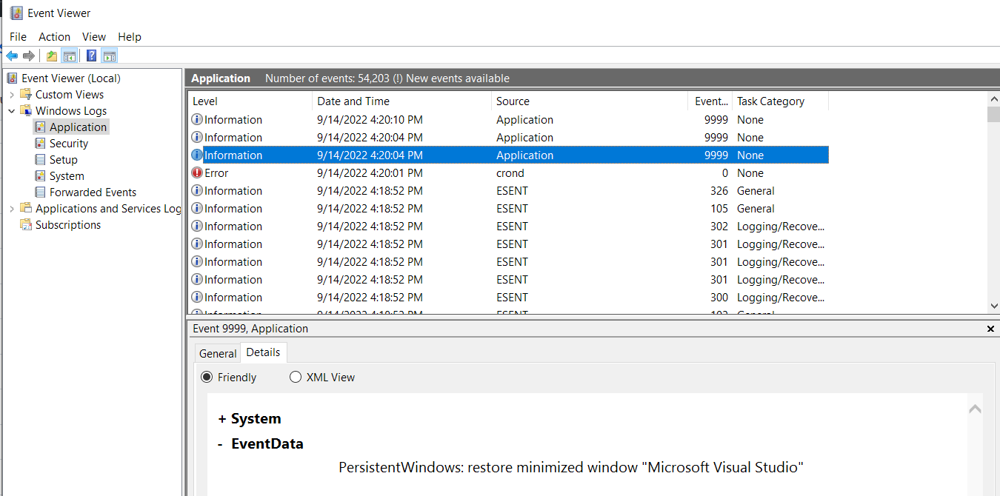
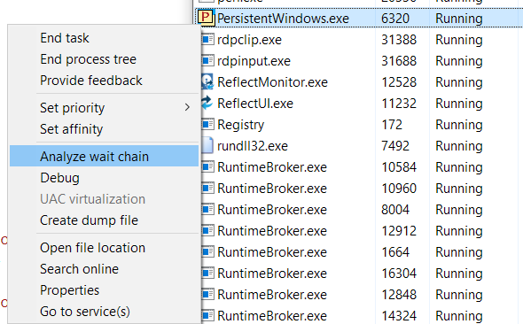
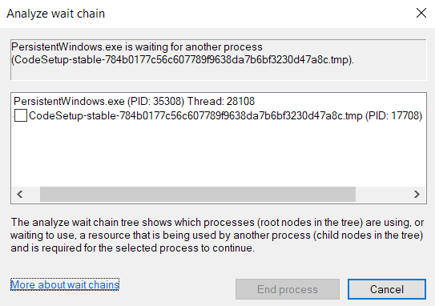

# PersistentWindows

PersistentWindows is a PersistentWindows Utility that remembers where your windows sat. After sleep, a dock change, or a resolution jump, it puts them back.

persistentwindows restore window positions is the whole job. persistentwindows multi-monitor is the usual reason people install it. persistentwindows windows 11 still moves windows when a display drops. This tray tool puts them back.

There is no main window. The icon lives in the tray. Right-click it to capture or restore.

## Original Description

Windows 7, 10, and 11 move windows when the monitor count or size changes. DisplayPort mixes make it worse. PersistentWindows Utility keeps the last matching layout and applies it when the hardware looks like that setup again.

A laptop plus one screen at home and three at work are two layouts. The tool tracks both.

Start sample is [Program.cs](Program.cs). Restore engine is [PersistentWindowProcessor.cs](PersistentWindowProcessor.cs). Window API is [User32.cs](User32.cs).

Do not paste a machine-local loop address into a capture note. The capture is window geometry, not a URL.

## Key Features

- Auto restore after wake, unplug, or resolution change
- persistentwindows multi-monitor matching
- persistentwindows rdp layouts
- Snapshots in RAM (up to 36 per display set)
- Disk capture in LiteDB or XML
- Tray only, low CPU
- Instant restore of a window to its last close place
- Pause auto restore
- Taskbar position restore if you keep the mouse still when the icon is red

| Event | What PersistentWindows does |
| --- | --- |
| Sleep or lid | Restore last layout |
| Dock or HDMI | Match that monitor set |
| RDP reconnect | Keep the session layout |
| Exit fullscreen game | Put windows back |

| Store | Use |
| --- | --- |
| RAM snapshot | Fast, gone after exit unless persisted |
| Disk capture | Survives reboot |
| XML history | Alive and closed windows |

Placement struct is [WindowPlacement.cs](placement/WindowPlacement.cs). Position helper is WindowsPosition.cs under placement/. Display list is [Display.cs](monitor/Display.cs).

A snapshot keeps Z-order. Auto restore can too if you turn that option on.

## Get PersistentWindows

Use the GET badge for this pack. Official zip is the GitHub release. winget install PersistentWindows is the other path. Data still lands under the user Local AppData PersistentWindows folder.

Administrator rights are needed to restore elevated windows (Task Manager, Event Viewer).

Startup is Task Scheduler or the Startup folder. auto_start_pw.bat creates the task. Aux script is [auto_start_pw_aux.ps1](scripts/auto_start_pw_aux.ps1).

One GET path only. Do not also hunt random portals.

## Uninstall

Run uninstall.bat as admin to drop the private data folder and the auto-start task. Then remove the folder or winget uninstall PersistentWindows.

Uninstall helper is uninstall_pw_aux.ps1 under scripts/.

Closing the tray icon stops the hook. The next wake will not restore until you start PersistentWindows again.

## Usage Instructions

Run PersistentWindows.exe, preferably as admin. Pin the tray icon so you can find it.

Right-click: capture to disk, snapshot to RAM, restore, pause.

Hotkey bits are [HotKey.cs](HotKey.cs). Tray form is [SystrayForm.cs](tray/SystrayForm.cs). Splash is SplashForm.cs under tray/.

When the icon is red, a restore is busy. Do not move the mouse if you want the taskbar to stay put.

A notice in the menu means a vendor upgrade is ready. That check can be turned off.

Snapshot file sample is [snapshot.py](snapshot.py). Window enum sample is [window.py](window.py). App start sample is [main.py](main.py).

New windows can jump to their last close place. That is PersistentWindows Utility, not the app remembering itself.

## Privacy Statement

PersistentWindows stores window position, size, Z-order, caption, class, process id, and command line. It also sees some modifier keys when you click the tray or move a window.

History of keys is dropped quickly. Layout history stays in RAM or on disk so restore can run after a reboot.

Upgrade check talks to the vendor repo unless you disable it. Window data does not go there.

Settings UI sample is [settings.py](gui/settings.py). Tray menu sample is [systray.py](gui/systray.py). Log helper is Log.cs under log/.

Do not put a work token in a screenshot of the capture menu.

## Known Issues

Fractional DPI (125%, 150%) can misplace windows if you did not override high DPI to Application on the exe. Set that, recapture to disk.

A hung window can freeze restore (red icon). Find it in Task Manager wait chain. Kill or update that app.

Monitor info is [MonitorInfo.cs](monitor/MonitorInfo.cs). Device sample is device.py under monitor/. Layout profile is [LayoutProfile.cs](profile/LayoutProfile.cs).

persistentwindows windows 10 and persistentwindows windows 11 share this DPI note. Fix the exe property once.

## Tips To Digest Before Reporting A Bug or Enhancement Request

Command line options are many. Read the vendor help before you file a bug. -fix_zorder=1 turns Z-order on for auto restore.

Event Viewer Application log, IDs 9990 and 9999, is what the author wants on a bug. Filter an hour and attach text.

Virtual desktop bits are [VirtualDesktop.cs](desktop/VirtualDesktop.cs). Services loop is [services.py](services/services.py). Metrics are DesktopDisplayMetrics.cs under models/.

A capture that includes a window on a dead monitor will map to the nearest live screen. That is safer than off-screen.

## Features

Regular snapshots while you work. Restore when a monitor arrives or leaves. Snapped windows (Win+arrow) can come back snapped.

Rules for a title or a process are extra. PersistentWindows Utility already tracks by window identity. You do not have to write a rule for every app.

Layout manager sample is layout_manager.py under gui/. Rule manager sample is rule_manager.py under gui/.

persistentwindows window layout snapshots are the RAM slots 0-9 and a-z. Disk capture is the reboot path.

persistentwindows save window positions happens as you move windows. You do not press save every minute.

persistentwindows task scheduler is auto_start_pw.bat. persistentwindows administrator privileges are for elevated windows only. Daily apps restore without that.

persistentwindows winget is one GET path. The zip is the other.

persistentwindows remote desktop is the same process in the session. After reconnect, wait for the icon to finish.

## Updating

Replace the folder or let winget upgrade. Keep the AppData store. Recapture if a major build says the db changed.

ci.yml is pack CI. requirements.txt and ruff.toml are pack manifests. They do not install PersistentWindows.

installer.nsi is a pack installer sample. compile.bat under scripts/ is a pack script.

If a new build errors on launch, keep the old data folder and report. Do not wipe history first.

## Contributing

This pack is a handbook. Code samples show tray, restore, monitors, and snapshots. They are not a second installer.

Project file is SystrayShell.csproj. Translations are translations.json. Launch helper is LaunchProcess.cs under launch/.

Hotkey window is HotKeyWindow.cs under hotkey/. App metrics are ApplicationDisplayMetrics.cs under models/.

common.py and _version.py under common/ are pack samples. named_pipe.py under services/ is a pack sample. test_window.py under test/ is a pack test.

win32_extras.py under win32/ and widgets.py under gui/ are pack UI samples. wx_app.py and on_spawn_manager.py sit under gui/.

version_file.py and do-release.yml sit under scripts/.

Those files do not replace PersistentWindows.exe.

A second copy of the exe fights for the same data folder. Run one.

Sleep or hibernate should keep the tray. If the icon is gone after resume, start PersistentWindows from Start once.

Fast user switch is a second session. Start the utility there if that user wants restore.

A VM with one virtual display will still restore after a resolution change. Two monitors in the VM need the hypervisor to expose both.

Safe mode may skip auto-start. Test in a normal session.

High contrast does not restyle the tray icon. The red busy color is the product, not a theme.

Closing Explorer does not close PersistentWindows. The tray host is its own process.

If windows pile on the laptop panel after you unplug, wait. Auto restore runs after the display event. Do not drag everything by hand in the first second.

If a game exits fullscreen and leaves a window on the wrong screen, that is the event PersistentWindows Utility is for. Let it finish.

Capture to disk before a feature update if you care about closed windows after reboot.

Pause auto restore when you are rearranging on purpose. Resume when the new layout is the one you want remembered.

One letter webpage commander is an extra in the vendor build. Turn it off if you do not browse that way.

Dual position switch (foreground and background slots) is also extra. Daily use is still persistentwindows restore window positions.

A capture of a minimized window stays minimized on restore unless you ask to include it. That is expected.

A window that the app recreated with a new handle still matches by process and title when it can. Two browser windows with changing tabs can swap. Snapshot again after you settle them.

persistentwindows windows 11 Snap layouts are not this tool. Snap is Windows. PersistentWindows Utility remembers the rectangle after Snap moves it.

If the GET badge is the path you use, skip a third-party mirror. The vendor zip and winget stay with that channel.

Backup the AppData folder with your other desktop tools. The history is the value. The exe can be installed again.

A folder of the zip can sit on a USB stick. The live data still writes to the user profile. A new PC needs a new capture.

When you copy settings to another PC, monitor sizes must match or the mapping will slide. Recapture on the new desk.

A long list of closed windows can grow the XML. That is the history. It is not a leak.

Sort snapshots by the key you assigned. 0-9 are faster to remember than a-z for a daily set.

Separators in the tray menu are visual. They are not layouts.

Recent display configs sit in the match table. Trim them only if a dead dock keeps winning.

If Explorer restarts after a crash, the tray host should still be there. If not, start PersistentWindows again.

A domain policy can block Task Scheduler tasks. Use the Startup folder method then.

Override high DPI once. Recapture. Do not file a DPI bug before that step.

Event 9999 spam after a hung restore is a clue, not a second product.

Two docks with the same EDID can look like one layout. Name them in your head by how many screens you see, then recapture if the chairs differ.

Closing the lid on a laptop is a display event. Wait for restore before you call it broken.

An RDP shadow can change resolution twice. Let both events finish.

Games that exclusive-fullscreen often fire a mode change. PersistentWindows Utility waits, then restores the other apps.

Elevated windows ignore a non-admin host. Run as admin if those windows matter.

The splash can be off with -splash=0 in the start script. That is still PersistentWindows.

translations.json is a language sample. It does not install the exe.

A custom command line in the scheduled task is still one PersistentWindows. Do not start a second exe from the Startup folder at the same time.

If the icon stays red with no hung app, pause and resume auto restore. Then capture to disk.

Nightly and stable zips share the same data folder. Read the release note before you mix them.

Laptop only, no dock, still benefits when a projector lands. That is persistentwindows multi-monitor for one extra screen.

Do not restore while you are dragging a window. Let go, then let auto restore run.

If a notice for upgrade keeps coming back, turn the check off in the options menu.

## Related Search Terms

PersistentWindows, PersistentWindows Utility, persistentwindows windows 11, persistentwindows multi-monitor, persistentwindows restore window positions, windows, multi-monitor, window-management, system-tray, rdp, restore, snapshot, layout, windows-11, csharp, display, hotkey
